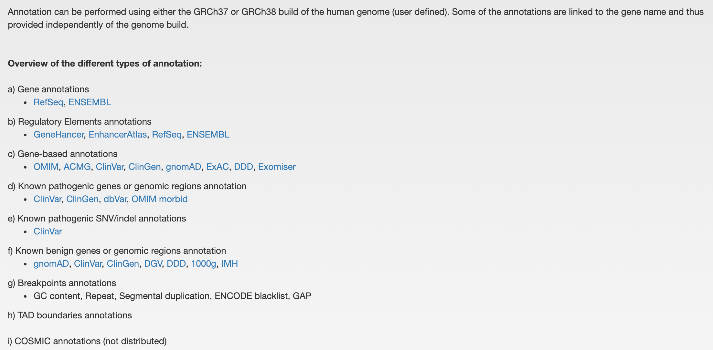
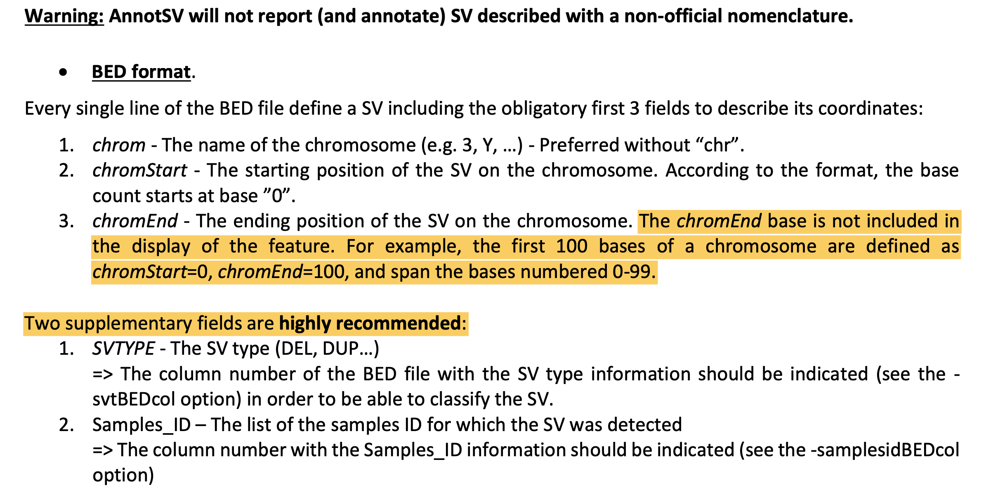

## [AnnotSV](https://lbgi.fr/AnnotSV/) 学习笔记

### 1.软件使用说明

[README.AnnotSV_latest.pdf](./README.AnnotSV_latest.pdf)

### 2.软件下载

[https://github.com/lgmgeo/AnnotSV](https://github.com/lgmgeo/AnnotSV)

### 3.下载对应的数据库

[Annotations_Human_3.0.9.tar.gz](https://www.lbgi.fr/~geoffroy/Annotations/Annotations_Human_3.0.9.tar.gz)

[2007_hg19.tar.gz](https://www.lbgi.fr/~geoffroy/Annotations/2007_hg19.tar.gz)

[2007_phenotype.zip](https://data.monarchinitiative.org/exomiser/data/2007_phenotype.zip)

[CosmicCompleteCNA.tsv.gz](https://cancer.sanger.ac.uk/cosmic) 

(将该文件放到$ANNOTSV/share/AnnotSV/Annotations_Human/FtIncludedInSV/COSMIC/GRCh37/)

### 4.数据库解压

    tar -xf 2007_hg19.tar.gz -C $ANNOTSV/share/AnnotSV/Annotations_Exomiser/2007/
    unzip 2007_phenotype.zip -d $ANNOTSV/share/AnnotSV/Annotations_Exomiser/2007/
    tar -xfAnnotations_Human_3.0.9.tar.gz -C $ANNOTSV/share/AnnotSV/

### 5.前提必备

bedtools,bcftools,tcl(**一般linux已经存在，which tclsh**)

### 6.数据测试

    cd /path/to/install/AnnotSV/share/doc/AnnotSV/Example/
    $ANNOTSV/bin/AnnotSV -SVinputFile test.bed -outputFile ./test.annotated.tsv -svtBEDcol 4

在运行示例的时候，会同时对COSMIC数据库文件进行处理，在:

    $ANNOTSV/share/AnnotSV/Annotations_Human/Users/GRCh37/FtIncludedInSV
    
    生成：
    
    CosmicCompleteCNA_GRCh37.formatted.sorted.bed  CosmicCompleteCNA_GRCh37.header.tsv
    
    以后每次运行就不需要在做特殊处理了。

### 7.数据输入格式

详细信息可以参照使用。
